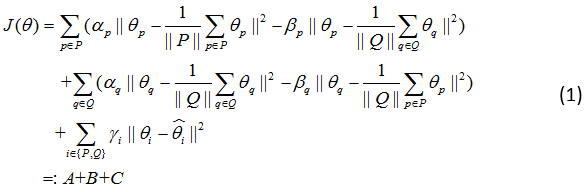
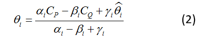
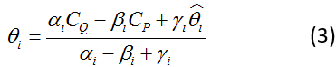
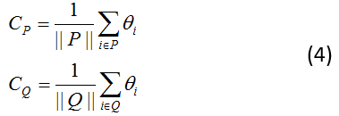
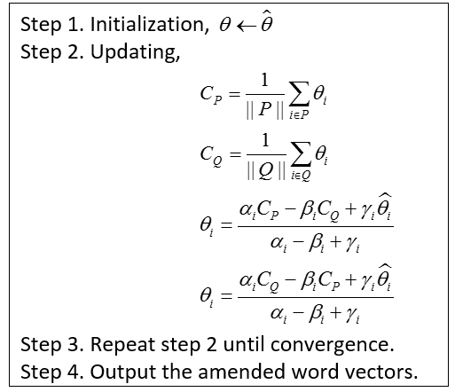

# Vecamend: Word Vectors Amending using Sentiment Lexicons

Vecamend: **Vec**tors **amend**

This project is a experiment for testing our method to amend word vectors obtained from any pre-trained models using sentiment lexicons.

### Chinese Introduction

动机：目前众多神经语言模型提供的词向量，不能很好的反映情感相似性，因为上下文相似的词语并一定具有相似的情感类别。传统的情感词典为情感词提供了重要的信息，词向量训练过程并没有融入传统词典信息，我们希望借助情感词典来优化现有词向量。

方法：基本思想是，利用情感词典（里面有正向词、负向词列表），让正向词尽量靠近正向词中心，并远离负向词中心，让负向词尽量靠近负向词中心，并远离正向词中心，同时不要偏离原始向量太远。具体而言，目标函数为：

  

目标是最小化目标函数*J(Θ)*，A部分目的是让正向词尽量靠近正向词中心，并远离负向词中心；B部分目的是让负向词尽量靠近负向词中心，并远离正向词中心；C部分目的是优化后的向量不要偏离原始向量太远。P、Q分别是正向和负向情感词对应的index。公式中A、B、C之间为相乘，也可以是相加，还需进一步确定。

如何求解最优解：使用iterative updating method。

实验论证：单词VA预测、twitter情感分类两个实验。

### Semantic Similar Words May Have Different Sentiment Polarity

Word vectors obtained from neural language models often suffer from the dilemma that semantic similar words may have different sentiment polarity, as these models are based on the assumption that words occurring in similar context tend to have similar word vectors. 

### Lexicon

可以使用的词典很多，主要包括以下这些。

##### 1. Bing-Liu's Lexicon

From: https://www.cs.uic.edu/~liub/FBS/sentiment-analysis.html#lexicon

This lexicon contains a list of positive and negative sentiment words, including 4783 negative words and 2006 positive words. 这些词汇可能有错误拼写，因为他们是从social media上自动收集得到的。 

### Word vector representations

词向量word2cec, GloVe等等

##### 1. Word2vec

The pre-trained word vectors are trained on 100 billion words of Google news dataset with 300 dimension.

### 词向量和情感词典共同出现的词汇量

word2vec和Bing-Liu's lexicon共同出现的词汇数

|词向量|Liu's positive words|Liu's negative words|
|----------|----------|----------|
|word2vec|1857 (92.57%)|4444 (92.91%)|
|GloVe|0|0|

### 优化前分类性能

对上述1857+4444 = 6301个词训练分类器，观察分类性能，cross-validation with 0.8 training data and 0.2 test data for 20 times, we use the average performance of 20 times. The result is as follows.

|分类器|准确率|
|-----|-----|
|Logistic Regression|95.182%|

### 优化后分类性能

目标函数：

  

使用efficient iterative updating method.

求偏导数等于0时参数的取值，当i∈P时，

  

当i∈Q时，

  

其中

  

表示正向词向量中心，和负向词向量中心

更新算法：

  

Convergence条件是cost function变化很小。

优化后，分类准确率为99.99%.

### Experiment 2: VA_prediction

We train a regression model on the amened word vectors. Anew lexicon is used, which contains words tagged with valence and arousal values manually. 

对word2vec pre-trained word vectors而言，有两个词没有出现，glamour和skijump，ANEW中其余1031个词都有出现，因此我们直接去掉这两个词。只使用1031个词，仍然cross-validation，0.2 for test and 0.8 for training. 一共执行20次，观察MSE、MAE、Pearson correlation coefficient metrics平均值。

**Experiemnt Result**

原始词向量实验结果

word2vec -> Valence

|回归方法|MAE|MSE|Pearson|
|-----|-----|-----|-----|
|ordinary least squares|0.9123|1.375|0.8232|
|ridge regression|**0.8091**|**1.1044**|**0.8607**|
|bayesian regression|0.8097|1.1064|0.8579|
|svr|0.825|1.1453|0.8533|
|knn reg|0.865|1.2714|0.8339|

word2vec -> Arousal

|回归方法|MAE|MSE|Pearson|
|-----|-----|-----|-----|
|ordinary least squares|0.7132|0.7828|0.6136|
|ridge regression|0.598|0.5624|0.6877|
|bayesian regression|0.5976|**0.5617**|0.6881|
|svr|**0.5859**|0.5665|**0.6894**|
|knn reg|0.6309|0.6501|0.6343|

使用优化之后的词向量实验结果

对于没有出现在优化后词向量中的单词，其词向量仍使用原始词向量

word2vec -> Valence

|回归方法|MAE|MSE|Pearson|
|-----|-----|-----|-----|
|ordinary least squares|0.855|1.2694|0.8364|
|ridge regression|0.7319|0.9749|0.8799|
|bayesian regression|0.7258|0.9631|0.8797|
|svr|0.729|0.992|0.8754|
|knn reg|0.8112|1.2938|0.8451|

word2vec -> Arousal

|回归方法|MAE|MSE|Pearson|
|-----|-----|-----|-----|
|ordinary least squares|0.7292|0.8527|0.5948|
|ridge regression|0.6157|0.5853|0.6711|
|bayesian regression|0.6211|0.5944|0.6671|
|svr|0.6142|0.608|0.6599|
|knn reg|0.6879|0.7328|0.5911|

(注： 以上实验参数是， alpha, beta, gamma = 1, 0.3, 1)

### Experiment 3: Sentiment classification

This experiment uses the DAN model to classify sentence into binary and fine-grained sentiment labels. The dataset we used includes SST (Socher, 2013) and IMDB movie review dataset (Maas, 2011).

##### Dataset

1. Stanford Sentiment Treebank (SST)

Dataset Description

|Task|Number of Training|Number of Validation|Number of Test|Total Number|
|---------|---------|---------|---------|---------|
|Fine-grained SA|8544|1101|2210|11855|
|Binary SA|6920|872|1821|9613|
|Continuous SA|8544|1101|2210|11855|

In the fine-grained sentiment classification task, we separate all the data in SST into five classes using the following cut-offs for *very negative, negative, neutral, positive, very positive*, respectively: 

[0, 0.2], (0.2, 0.4], (0.4, 0.6], (0.6, 0.8], (0.8, 1.0]

In practise, integer numbers from 1 to 5 is used to indicate the above five classes. 

In the binary sentiment classification task, the sentences with sentiment value between 0.4 and 0.6 are ignored, and the sentiment of sentence is regarded as negative if its sentiment ratings is less than 0.4 and positive if greater than 0.6.
 
In the continuous sentiment prediction task, the original sentiment labels are used as the valence of a sentence, and we trained a regression model to predict the valence of sentence.

Note that all the data are separated into training, validation and testing data according to the splitting method provided by Richard Socher for fair comparison. The validation data is the same to the develop data.

##### Experiment result

Model visualization: [model.png](./images/model.png)

DAN for binary SA:

### Important Dependencies

* Python 3.4.3
* Keras 0.3.0
* pydot2 1.0.33 (for model visualization)

There are some frequent questions and answers in [Q&A.md](./resources/Q&A.md) file. If you have any other questions or advice, any feedback is welcomed.
