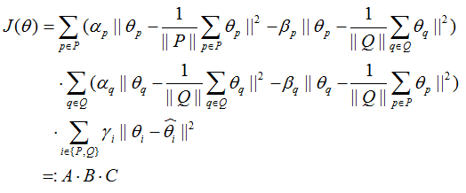

# Vecamend: Word Vectors Amending using Sentiment Lexicons

Vecamend: **Vec**tors **amend**

This project is a experiment for testing our method to amend word vectors obtained from any pre-trained models using sentiment lexicons.

### Chinese Introduction

动机：目前众多神经语言模型提供的词向量，不能很好的反映情感相似性，因为上下文相似的词语并一定具有相似的情感类别。传统的情感词典为情感词提供了重要的信息，词向量训练过程并没有融入传统词典信息，我们希望借助情感词典来优化现有词向量。

方法：基本思想是，利用情感词典（里面有正向词、负向词列表），让正向词尽量靠近正向词中心，并远离负向词中心，让负向词尽量靠近负向词中心，并远离正向词中心，同时不要偏离原始向量太远。具体而言，目标函数为：

  

目标是最小化目标函数*J(Θ)*，A部分目的是让正向词尽量靠近正向词中心，并远离负向词中心；B部分目的是让负向词尽量靠近负向词中心，并远离正向词中心；C部分目的是优化后的向量不要偏离原始向量太远。P、Q分别是正向和负向情感词对应的index。公式中A、B、C之间为相乘，也可以是相加，还需进一步确定。

如何求解最优解：使用iterative updating method。

实验论证：单词VA预测、twitter情感分类两个实验。

### Semantic Similar Words May Have Different Sentiment Polarity

Word vectors obtained from neural language models often suffer from the dilemma that semantic similar words may have different sentiment polarity, as these models are based on the assumption that words occurring in similar context tend to have similar word vectors. 

### Lexicon

可以使用的词典很多，主要包括以下这些。

##### 1. Bing-Liu's Lexicon

From: https://www.cs.uic.edu/~liub/FBS/sentiment-analysis.html#lexicon

This lexicon contains a list of positive and negative sentiment words, including 4783 negative words and 2006 positive words. 这些词汇可能有错误拼写，因为他们是从social media上自动收集得到的。 

### Word vector representations

词向量word2cec, GloVe等等

##### 1. Word2vec

The pre-trained word vectors are trained on 100 billion words of Google news dataset with 300 dimension.

### 词向量和情感词典共同出现的词汇量

word2vec和Bing-Liu's lexicon共同出现的词汇数

|词向量|Liu's positive words|Liu's negative words|
|----------|----------|----------|
|word2vec|1857 (92.57%)|4444 (92.91%)|
|GloVe|0|0|

### 优化前分类性能

对上述1857+4444 = 6301个词训练分类器，观察分类性能，cross-validation with 0.8 training data and 0.2 test data for 20 times, we use the average performance of 20 times. The result is as follows.

|分类器|准确率|
|-----|-----|
|Logistic Regression|95.182%|